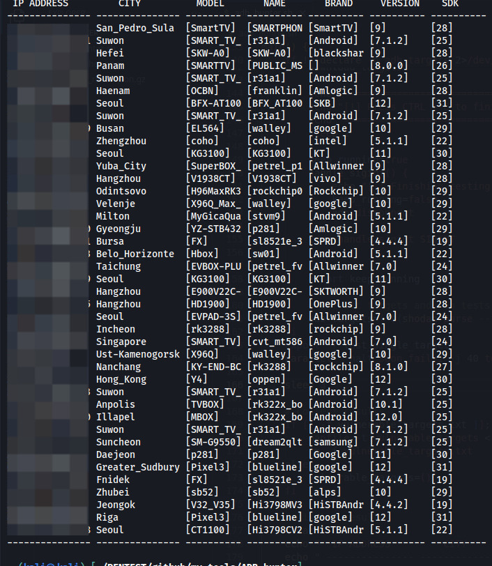

# 💾 Who am i?

***

<figure><figcaption><p>Pic of me at RootedCon 2024</p></figcaption></figure>

***

## EDUCATION

* Bachelor's degree in computer science completed at the Instituto Comercial Panamá.
* Studying a cybersecurity degree at the Universidad Tecnológica de Panamá.

***

## ACHIEVEMENTS

<details>

<summary>​Third place <a href="https://www.linkedin.com/posts/johan-giraldo-785a06268_tercer-lugar-en-el-hackathon-de-copa-arilines-activity-7074128375883124736-BlQY?utm_source=share&#x26;utm_medium=member_desktop">Copa Airlines Hackathon 2022</a> (Infraestructure as Code).</summary>


I found it to be an excellent challenge and i acquired a basic knowledge of Terraform.

</details>

<details>

<summary>First place <a href="https://www.linkedin.com/posts/johan-giraldo-785a06268_python-django-mysql-activity-7074129061714751488-wktP?utm_source=share&#x26;utm_medium=member_desktop">Innova Banesco Challenge 2022</a> (Web App development).</summary>


A very interesting challenge in which knowledge of Python programming, web design and databases is used.

</details>

<details>

<summary>Fifth place <a href="https://www.linkedin.com/posts/johan-giraldo-785a06268_eks-kubernetes-aws-activity-7074130579645947904-lABW?utm_source=share&#x26;utm_medium=member_desktop">Copa Airlines Hackathon 2023</a> (Cloud Computing).</summary>


A challenge that i personally found a bit complicated, however very interesting in which we applied knowledge of cloud computing with Kubernets on AWS.

</details>

<details>

<summary>Participation in the <a href="https://www.linkedin.com/posts/johan-giraldo-785a06268_inteligenciaartificial-python-utp-activity-7084254110857736192-BsM1?utm_source=share&#x26;utm_medium=member_desktop">JIC-UTP 2023</a> (Jornada de Iniciación Cientifíca) at the Universidad Tecnológica de Panamá  </summary>


Presenting the project "prototype of IDS in network traffic using AI"

</details>

***

## PROJECTS

<details>

<summary><a href="https://github.com/mind2hex/adb_hunter">adb_hunter</a>  (Bash)</summary>

Bash script to enumerate ADB devices with shell access without autentication. With this script you can check if you can access an ADB device using command `adb`. It downloads automatically targets using shodan or you can specify a single target using `-t  <target_ip>` .

### Usage

```
Usage: adb_hunter.sh [options]

Options:
  -h, --help          Show this help message and exit
  -v, --version       Show script version and exit
  -t, --target        Specify a single target instead of test targets from shodan
  -s, --save          Dont delete result file (vulnerable_targets.txt)
```



</details>

<details>

<summary><a href="https://github.com/mind2hex/crackahash">Crackahash</a> (Python)</summary>

Crackahash is a tool written in python that let you crack hashes from your desktop machine. Simply start a SSH service and an ngrok tunnel in your laptop from anywhere and crackahash will connect and download the juicy hash from your laptop using ngrok API, after that, it will start hashcat optimized to use your GPU to crack the hash and if succeed, it will send the password to your email.

### Usage

.png>)

.png>)

.png>)

</details>

<details>

<summary><a href="https://github.com/mind2hex/wirelesswizard/">WirelessWizard</a> (Python)</summary>

Python project uploaded to pypi.org.  This project is used to handle wireless interfaces using python.

### Usage

.png>)

</details>

<details>

<summary><a href="https://github.com/mind2hex/webtoolkit">WebToolkit</a> (Python)</summary>

Tools for web pentesting.&#x20;

### WebCrawl

```
               _      _____                    _ 
              | |    / ____|                  | |
 __      _____| |__ | |     _ __ __ ___      _| |
 \ \ /\ / / _ \ '_ \| |    | '__/ _` \ \ /\ / / |
  \ V  V /  __/ |_) | |____| | | (_| |\ V  V /| |
   \_/\_/ \___|_.__/ \_____|_|  \__,_| \_/\_/ |_|
                                                 
    author:  mind2hex
    version: 1.0
    
usage: ./WebCrawler.py [options] -u {url} 

a simple python web crawler

options:
  -h, --help           show this help message and exit
  -u , --url           target url. ex --> http://localhost/
  -H , --headers       set HTTP headers. ex --> 'Header1=lol&Header2=lol'
  -P , --proxies       set proxies. ex --> 'http;http://proxy1:8080,https;http://proxy2:8000'
  -D , --download      coma separated extension files to download. ex --> jpg,pdf,png
  -x , --exclude-url   comma separated domains to exclude. ex --> google.com,youtube.com
  -U , --user-agent    specify user agent
  -N, --no-follow      follow redirections
  --rand-user-agent    randomize user-agent
  --usage              show usage examples
  --ignore-errors      ignore connection errors
  -d , --depth         max crawling depth

performance options:
  -rt , --retries      retries per connections if connection fail [default 0]

debugging options:
  -v, --verbose        show verbose messages
  --debug              show debugging messages
  -o , --output        save indexed urls to a file
  -q, --quiet          dont show config before execution

https://github.com/mind2hex/
```

### WebEnum

```
               _     ______                       
              | |   |  ____|                      
 __      _____| |__ | |__   _ __  _   _ _ __ ___     _
 \ \ /\ / / _ \ '_ \|  __| | '_ \| | | | '_ ` _ \   |-|  __
  \ V  V /  __/ |_) | |____| | | | |_| | | | | | |  |=| [wE]
   \_/\_/ \___|_.__/|______|_| |_|\__,_|_| |_| |_|  "^" ====`o   
                                                  
    author:  mind2hex
    version: 1.0
    
usage: ./webEnum.py [options] -u {url} -w {wordlist}

a simple python web directory enumerator

options:
  -h, --help            show this help message and exit
  -u , --url            target url to enumerate                  - example '-u http://localhost:6969/'
  -w , --wordlist       wordlist path to use in enumeration      - example '-w /path/to/wordlist.txt'
  -W , --gen-wordlist   create wordlist using a dir structure    - example '-W /home/user/Downloads/wordpress/'
  -M , --http-method    HTTP Method to use                       - example '-M GET'
  -H , --headers        http headers to use in every request     - example '-H Header1=foo&Header2=bar'
  -A , --user-agent     specify user agent. default[yoMamma]     - example '-ua yoMamma'
  -C , --cookies        cookies to use in every request          - example '-C Cookie1=foo&Cookie2=bar'
  -b , --body-data      body data to send using POST method      - example '-b username=admin&password=admin'
  -P , --proxy          proxies to send every request            - example '-P http=http://localhost:6969'
  -x , --extension      additional extensions to probe           - example '-x php,js,txt'
  -j, --json            send post data in json format            - example '-j -b {'username':'admin'}'
  -s, --add-slash       add slash to every word in wordlist      - 
  -f, --follow          follow redirections.                     - default[False]
  -R, --randomize-ua    randomize user agent.                    - default[False]
  -I, --ignore-errors   ignore connection errors                 - 
  --usage               show usage                               - 
  -V, --verify          verify certificate                       - default[False]

performance options:
  -t , --threads        threads. default[01]                     - example '-t 10'
  -to , --timeout       time to wait for a response default[10]  - example '-to 10'
  -tw , --timewait      time to wait between requests default[0] - example '-tw 10'
  -rt , --retries       retry failed connections                 - example '-rt 10'

debugging options:
  -v, --verbose         show verbose messages                    - 
  -d, --debug           show debugging messages                  - 
  -o , --output         save output to a file                    - example '-o output.txt'
  -q, --quiet           dont show config before execution        - 

filter options:
  -hs , --hs-filter     hide responses using status code         - example '-hs 500,400'
  -hc , --hc-filter     hide responses using content length      - example '-hc nnnn,nnn'
  -hw , --hw-filter     hide responses using web server          - example '-hw nginx'
  -hr , --hr-filter     hide responses using regex               - example '-hr failed'

https://github.com/mind2hex/
```

### WebFuzz

```
               _     ______                      
              | |   |  ____|                     
 __      _____| |__ | |__ _   _ ___________ _ __ 
 \ \ /\ / / _ \ '_ \|  __| | | |_  /_  / _ \ '__|
  \ V  V /  __/ |_) | |  | |_| |/ / / /  __/ |   
   \_/\_/ \___|_.__/|_|   \__,_/___/___\___|_|   
                                                 
    author:  mind2hex
    version: 1.0
    
usage: ./webFuzzer.py [options] -u {url} -w {wordlist}

a simple python multithreading web fuzzer

options:
  -h, --help           show this help message and exit
  -u , --url           target url. ex --> http://localhost/FUZZ
  -w , --wordlist      wordlist
  -b , --body-data     body data to send using POST method. ex --> 'username=admin&password=FUZZ'
  -C , --cookies       set cookies. ex --> 'Cookie1=lol&Cookie2=lol'
  -H , --headers       set HTTP headers. ex --> 'Header1=lol&Header2=lol'
  -P , --proxies       set proxies. ex --> 'http;http://proxy1:8080,https;http://proxy2:8000'
  -U , --user-agent    specify user agent
  -M , --http-method   HTTP to use. [GET|POST|HEAD]
  --magic              specify magic word [default:FUZZ]
  -js, --json          if specified, then body data should be json. ex --> -b {'username':'FUZZ'}
  -f, --follow         follow redirections
  --rand-user-agent    randomize user-agent
  --usage              show usage examples
  --ignore-errors      ignore connection errors, useful to enumerate fuzz subdomains

performance options:
  -t , --threads       threads [default 1]
  -to , --timeout      time to wait for response in seconds [default 10]
  -tw , --timewait     time to wait between each requests in seconds [default 0]
  -rt , --retries      retries per connections if connection fail [default 0]

debugging options:
  -v, --verbose        show verbose messages
  -d, --debug          show debugging messages
  -o , --output        save output to a file
  -q, --quiet          dont show config before execution

filter options:
  -hs , --hs-filter    hide responses with the specified status codes. ex: '300,400'
  -hc , --hc-filter    hide responses with the specified content lenghts. ex: '1234,4321'
  -hw , --hw-filter    hide responses with the specified web servers. ex: 'apache,nginx'
  -hr , --hr-filter    hide responses matching the specified pattern. ex: 'authentication failed'

https://github.com/mind2hex/

```

</details>

<details>

<summary><a href="https://github.com/mind2hex/netrunner">NetRunner</a> (Python)</summary>

Remote Administration Tool written in python.

### Usage

```
$ python3 NetRunner.py -h
usage: ./netrunner.py [options] 

Remote Administration Tool

options:
  -h, --help        show this help message and exit
  -l, --listen      start server mode, listen on specified port
  -p , --port       specified port
  -t , --target     specified IP
  --max-listeners   specified max listening sessions. default[5]
  --password        Specify password for NetRunner server

Examples:
        # start a NetRunner in servermode 
        ./NetRunner.py -t 192.168.0.1 -p 5555 -l 

        # conect to a NetRunner server using NetRunner in client mode
        ./netrunner.py -t 192.168.0.1 -p 5555 

        NetRunnerCommands Engine
        # To use NRC Engine, we should first connect to a NR server using NR client

        # SHOW NRC HELP
        netrunner: #> $NRC HELP   

        # SHOW NRC MODULE HELP
        netrunner: #> $NRC [MODULE_NAME] HELP

https://github.com/mind2hex/

```

</details>

<details>

<summary><a href="https://github.com/mind2hex/tcpcobra">TCPCobra</a> (Python)</summary>

A simple python tcp proxy.

### Usage

```
$ python3 TCPCobra.py -h 
⠀⠀⠀⠀⠀⠀⠀⠀⠀⠀⠀⠀⠀⠀⣀⡀⠀⣀⠀⠀⠀⠀⠀⠀⠀⠀⠀⠀⠀⠀
⠀⠀⠀⠀⠀⠀⠀⠀⢠⣴⣾⡿⠿⠿⠿⠷⠦⠿⠿⠀⠀⠀⠀⠀⠀⠀⠀⠀⠀⠀
⠀⠀⠀⠀⠀⠀⠀⠀⠉⡉⠛⢠⣾⣷⡀⠰⣦⠀⠀⠀⠀⠀⠀⠀⠀⠀⠀⠀⠀⠀
⠀⠀⠀⠀⠀⠀⠀⠀⠸⠇⠀⣈⣀⣀⣀⣀⠈⠂⠀⠀⠀⠀⠀⠀⠀⠀⠀⠀⠀⠀
⠀⠀⠀⠀⠀⠀⠀⠀⠲⣶⡄⠘⠛⠛⠛⠛⠀⠀⠀⠀⠀⠀⠀⠀⠀⠀⠀⠀⠀⠀
⠀⠀⠀⠀⠀⠀⠀⠀⠀⠙⢷⡀⠻⣿⠿⠿⠀⠀⠀⠀⠀⠀⠀⠀⠀⠀⠀
⠀⠀⠀⠀⠀⠀⠀⠀⠀⠀⠀⠉⠀⠀⢴⣶⣶⡄⠀⠀⠀⠀⠀⠀⠀⠀⠀⠀⠀⠀
⠀⠀⠀⠀⠀⠀⠀⠀⠀⠀⠀⠀⠀⠀⠀⠉⢁⣤⣤⡀⠀⠀⠀⠀⠀⠀⠀⠀⠀⠀
⠀⠀⠀⠀⠀⠀⠀TCPCobra⠀⠀⠛⠋⣉⣀⠀⠀⠀⠀⠀⠀ author: mind2hex⠀⠀⠀
⠀⠀⠀⠀⠀⠀⠀⠀⠀⠀⠀⠀⠀⠀⠀⠀⠀⠀⠸⣿⣿⣷⡀⠀⠀⠀⠀version:⠀1.0⠀⠀
⠀⠀⠀⠀⣀⣠⣤⣶⠶⠶⠟⠛⠛⠛⠋⠁⠀⠀⠀⣿⣿⣿⣧⠀⣀⡀⠀⠀⠀⠀
⠀⠀⠀⠰⣿⣿⠷⠶⠶⠿⠿⠿⠿⠿⠿⠿⠿⠿⢁⣿⣿⣿⣿⠀⠿⢛⣻⡆⠀⠀
⠀⠀⢀⣠⣤⣤⣤⣶⣶⣶⣶⣶⡶⠶⠖⠒⢀⣤⣾⣿⣿⣿⡟⢀⣾⣿⡿⠃⠀⠀
⠀⠀⠘⠿⣿⣿⣿⣷⣶⣶⣶⣶⣶⣶⣶⣿⣿⣿⣿⡿⠿⠋⠀⠀⠀⠀⠀⠀⠀⠀
⠀⠀⠀⠀⠀⠀⠉⠉⠉⠉⠉⠉⠉⠉⠉⠉⠉⠁⠀⠀⠀⠀⠀⠀⠀⠀⠀⠀⠀⠀

Usage: ./proxy.py [localhost] [localport] [remotehost] [remoteport] [receive_first] Example: ./proxy.py 127.0.0.1 9000 10.12.132.1 9000 True
```

</details>

<details>

<summary><a href="https://imarpanama.com/">IMAR Panama</a> (Python Flask)</summary>

Back-End of IMAR Panama web page.

.png>)

</details>

<details>

<summary><a href="https://github.com/mind2hex/HackPack_USB">HackPack USB</a> (Python, Bash, Powershell)</summary>

Kit of tools that i carry in my USB to automate enumeration and looting.

.png>)

</details>

<details>

<summary><a href="https://github.com/search?q=owner%3Amind2hex+CVE&#x26;type=repositories">CVE's PoC</a> (Python, Bash)</summary>

I have developed some exploits for CVE's which you cand find in my github account.

.png>)

* [_CVE_-2022-39986](https://github.com/mind2hex/CVE-2022-39986): bash script for automated discovery and exploitation of machines with the _CVE_-2022-39986 vulnerability.

<!---->

* [_CVE_-2023-38035](https://github.com/mind2hex/CVE-2023-38035): Script to exploit _CVE_-2023-38035.

<!---->

* [_CVE_-2019-16113](https://github.com/mind2hex/CVE-2019-16113): Bludit 3.9.2 Remote Command Execution (RCE)

<!---->

* [_CVE_-2021-31630](https://github.com/mind2hex/CVE-2021-31630): OpenPLC 3 WebServer Authenticated Remote Code Execution.

<!---->

* [_CVE_-2019-17240](https://github.com/mind2hex/CVE-2019-17240): Bludit 3.9.2 auth bruteforce bypass
* [_CVE_-2022-46169](https://github.com/mind2hex/CVE-2022-46169)

</details>

You can see more projects i have been working on in this gitbook or my [github](https://github.com/mind2hex) account if you want.&#x20;

Here you'll find:

* Write-ups from cybersecurity platforms like hackthebox, tryhackme, microcorruption, etc.&#x20;
* Programming languages documentation, tips and tools i made.
* Cybersecurity topics.

***

## WRITE UPS


[hackthebox](write-ups/hackthebox/)



[microcorruption](write-ups/microcorruption/)


***

## PROGRAMMING


[python.md](programming/python.md)


***

## CYBERSECURITY


[networking](cybersecurity-topics/networking/)



[web.md](cybersecurity-topics/web.md)



[binary-analysis](cybersecurity-topics/binary-analysis/)


***

## OTHERS

My Github account where i upload all tools i developed.


My Github Account


You might also be interested in checking out my hacker group's blog where i regularly upload content oriented to cybersecurity topics.


ZeroTrustOffsec


***

## CONTACT ME



***
