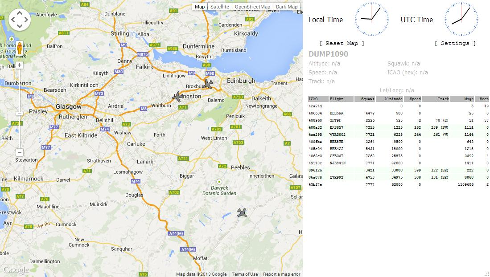

# ✈️ Airspace Traffic Tracking

***

## Requirements

* [RTL-SDR v3](https://www.amazon.com/-/es/RTL-SDR-RTL2832U-definida-software-antena/dp/B0BMKB3L47/?\_encoding=UTF8\&pd\_rd\_w=5AfAg\&content-id=amzn1.sym.d0ebfbb2-6761-494f-8e2f-95743b37c35c%3Aamzn1.symc.50e00d6c-ec8b-42ef-bb15-298531ab4497\&pf\_rd\_p=d0ebfbb2-6761-494f-8e2f-95743b37c35c\&pf\_rd\_r=KTT0Y56VTWDNK4QX38BN\&pd\_rd\_wg=mZRJv\&pd\_rd\_r=499ca8a6-583a-4d8e-a467-9460a30000bb\&ref\_=pd\_gw\_ci\_mcx\_mr\_hp\_atf\_m)
* [dump1090](https://github.com/antirez/dump1090)

***

## What is ADS-B?

The Automatic Dependent Surveillance - Broadcast system or ADS-B is a surveillance technology in which an airplane determines its own position using satellite navigation (like GPS). This allow us to track airplane traffic. The information sent by an airplane to satellites can be received by ground air traffic control radio stations.

### How ADS-B works?

ADS-B consists in two different services, "ADS-B Transmission" and "ADS-B Reception".&#x20;

**ADS-B Transmission** send periodically information about an airplane, like the identification, actual position, altitude and velocity using an onboard transmitter. Also, the  ADS-B  transmission system let the ground air traffic control radio stations to know the actual position of the airplane more precisely than conventional radars.

**ADS-B Reception** is the receiver of ADS-B data, in this case we will turn a simple RTL-SDR in an ADS-B Receiver using dump1090.

***

## What is dump1090?

Dump 1090 is a Mode S decoder specifically designed for RTL-SDR devices. Dump 1090 is a popular software used to receive and decode ADS-B signals sent by airplanes. It is higly optimized to work with a RTL-SDR to capture ADS-B signals in the 1090 MHz frequency. After receiving the signal, dump1090 decode it and show the airplanes in a real time map using a web interface.

### Installing dump1090

To install dump1090, we need to execute the following commands:

```bash
# cloning the dump1090 github repository
$ git clone https://github.com/antirez/dump1090

# change directory to the cloned repository 
$ cd dump1090

# compile dump1090
$ make
```

Now we can use dump1090.

### Using dump1090

The usage of dump1090 is pretty simple and straightforward. But first we need to connect the RTL-SDR to our machine.&#x20;

After connecting the RTL-SDR to our machine, we can execute the following command inside the cloned github repository:

```bash
# --interactive : Refresh data constantly on the terminal
# --net         : Enables networking
# --aggressive  : Receive more messages
$ ./dump1090 --interactive --net --agressive
```

After executing the command above, if you visit [http://localhost:8080/](http://localhost:8080/) you should see something like this:

<figure><figcaption></figcaption></figure>

As a recommendation, get in a high place with clear sky and you'll get a better signal.

***
